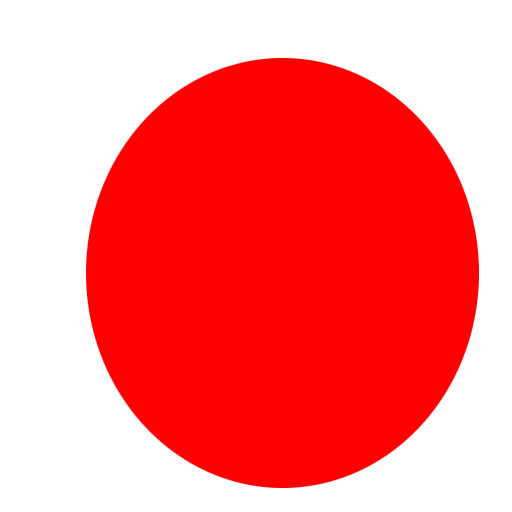
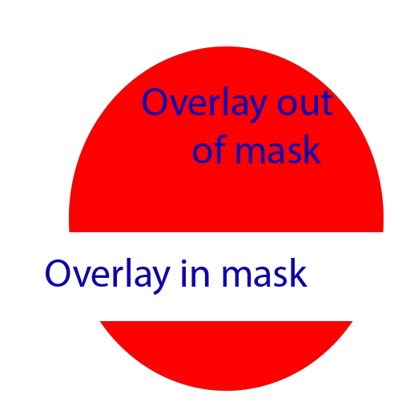

# Layering Tool

simple command line script in python that supports 2 operations via parameter:
- mask an image (RGB / RGBA) with another image ("mask", RGB or grayscale)
- compose another image (RGBA "overlay") on top

currently supports only 8bit color space.

### Usage:
> python layering.py --image images/image.png --mask images/mask.png --overlay images/overlay.png --name result

### Example:

Image:  

Mask:  

Overlay:  

Result:  

